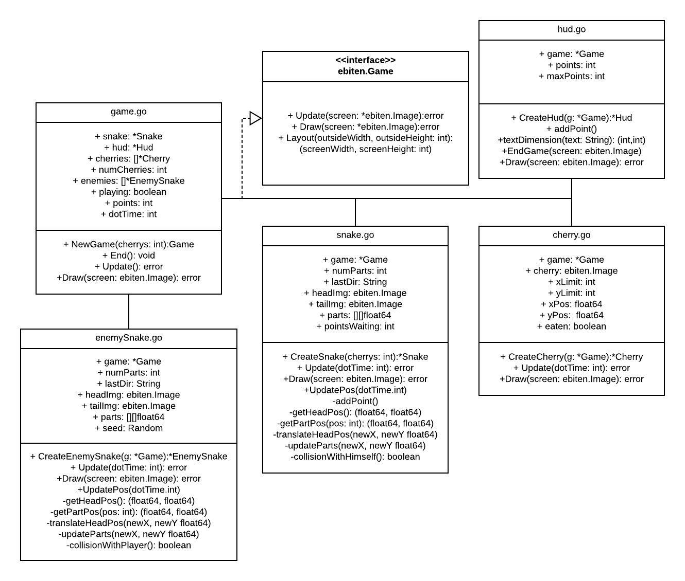

# GoSnake

Concurrent Snake Game in go.

## Architecture
**Ebiten library**

According to their [documentation](https://github.com/hajimehoshi/ebiten/): Ebiten is an open source game library for the Go programming language. Ebiten's simple API allows you to quickly and easily develop 2D games that can be deployed across multiple platforms.

**Ebiten Game Design**

Ebiten library's `ebiten.Game` interface makes game development in go very easy, there are three necessary methods that require implementation:
* **Update**: This method is where you put the game logic, which will be updated each `Tick` (1/60th of a second).
* **Draw**: Method to render the images in every frame. 
* **Layout**: Method that defines the overall game layout.

### Game Structure
We organize the project into three main folders and the `main.go` file: 

* root 
    * assets/
    * entities/
    * util/
    * main.go

Since Ebiten's engine mostly consists of image and graphics rendering, we need an `assets/` folder. This is where all our image resources for our GUI will be placed.

The `entities/` folder is the most important one, this is where the game logic resides. The main entities needed for the game are:
* Game [game.go] (https://github.com/DiegoSolorzanoO/GoSnake/blob/master/entities/game.go)
* Snake [snake.go] (https://github.com/DiegoSolorzanoO/GoSnake/blob/master/entities/snake.go)
* Cherry [cherry.go] (https://github.com/DiegoSolorzanoO/GoSnake/blob/master/entities/cherry.go)
* Enemy (instances of snake) [enemySnake.go](https://github.com/DiegoSolorzanoO/GoSnake/blob/master/entities/enemySnake.go)
* A Hud [hud.go] (https://github.com/DiegoSolorzanoO/GoSnake/blob/master/entities/hud.go)

`game.go` will have all `ebiten.Game` interface methods implemented, in addition to the following functions and methods 
* NewGame: function that instanciates a new game
* End: method to end game.
* Logic behind cherry eats

As we know, we need to implement the `Game` interface. This is done in `main.go` for simplicity reasons, but inside `game.go` we will code the functionality of the structure.

`snake.go` is the main player Snake structure. A snake can do the following:
* **UpdatePos**. A snake should be able to move in the XY plane. It should have a tick delay so it could move in an arcade-fashion way. Since our types of snakes are "Player" and "Enemy", the former will have input controls by keyboard arrow keys and the latter will have a random moving behavior.
* **Eat**. A snake should be able to eat a cherry whenever its head collisions with it, triggering its own Grow function
* **Grow**. A snake should be able to grow its body by 1 unit whenever it eats a cherry. All body parts should form a trail according to the movement.
* **Die**. A snake should die whenever it collisions with something different than a cherry. (walls, other snake, or its own body)

In the image below you can see all entities and methods in detail

### Concurrency

We will implement a thread-safe version of the game, since ebiten library makes everything happen inside their Update method, we can create channels that can communicate with each snakes including the player.